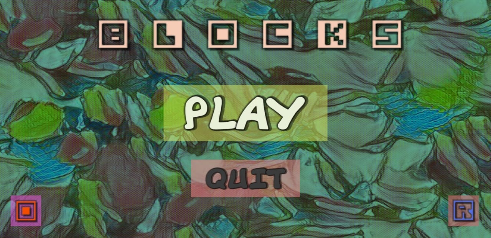
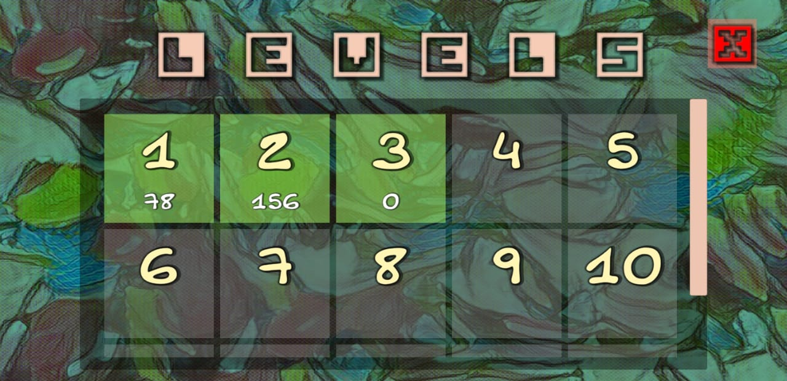
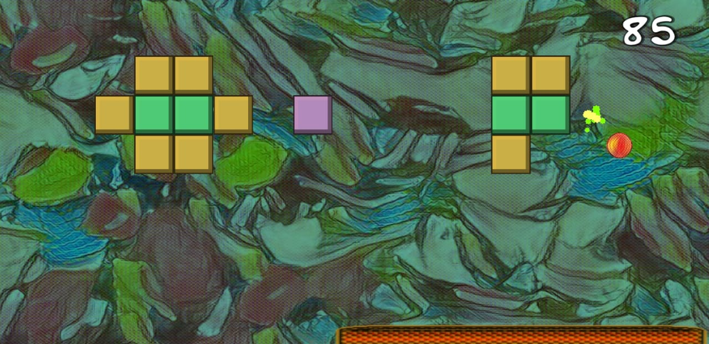

# Block-Breaker-Game
Unity based Block Breaker game projec for android devices. 
Personal project for learning C# and getting familiar with Unity platform.

## Screenshots

## Tools used while developing this project.
- Unity
- GitBash
- Visual Studio 2019. Coding in C# programming language

## How to install? (android only)
- Find BlockBreaker.apk file
- Download
- Load it to your android device
- Install the game
- Enjoy

## Game Description

### Game Controls
- Left and Right half of screen corresponds to movements
- Tap on screen to shoot the ball

## Contacts 
- E-mail address orkhan.elchuev@gmail.com
- https://github.com/OrkhanElchuev/Space-Invader-Game

## Acknowledgements
- [dafont](https://www.dafont.com/de/)
- [LunaPic](https://www1.lunapic.com/editor/)
